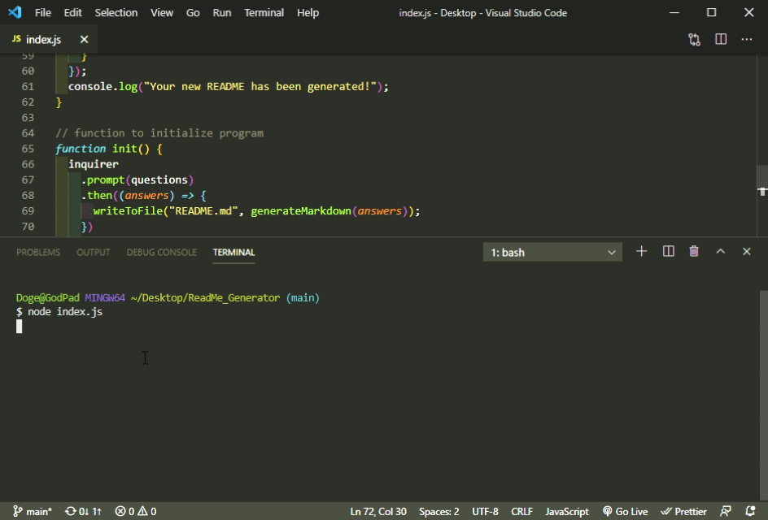

# README Generator

#

## When to use the Generator

This README Generator is meant to be executed across a command line. I recommend Gitbash primarily but any that will allow you to `node index.js` will be adequate. Make sure to run this with file creation permissions as it will attempt to generate a text file.

## Packages / Technologies Used

- Node.js
- Javascript
- Inquirer (npm package)

## How to use

- Clone this repository.
- Open Gitbash command interface.
- Run `npm install` in the root directory. Wait for packages to download (<2 minutes).
- Open a terminal inside the root directory.
- Run `node server.js` and follow the prompts that pop up in the console.
- Hold out hands and receive bacon.

## Quick GIF Demo

